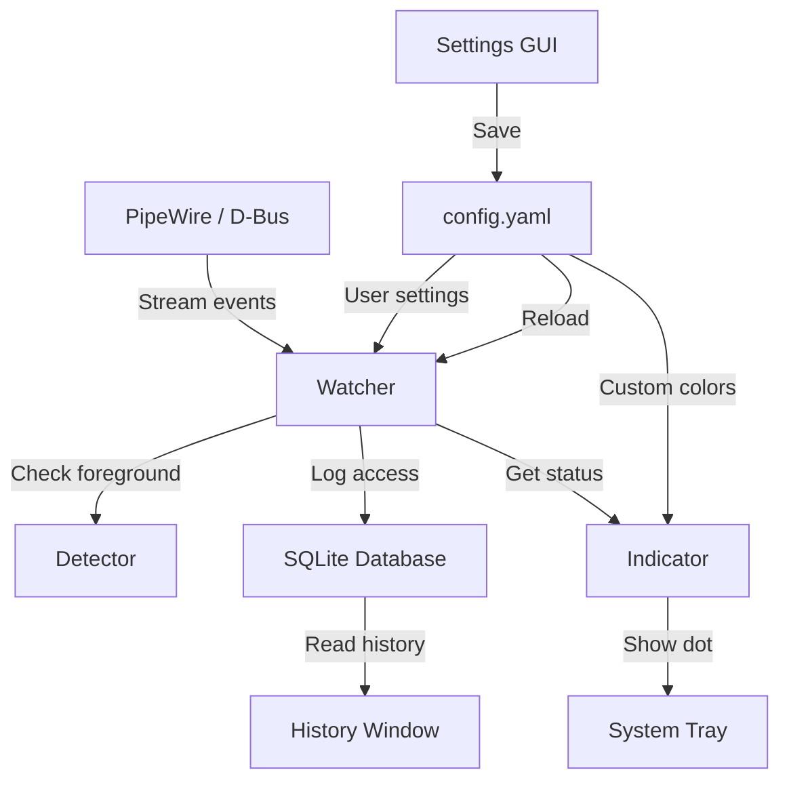

# 🟢 Dot - Privacy Indicator for Linux

> **Take back control of your privacy.**  
> A sleek system tray indicator that shows you exactly when apps are spying through your microphone or camera.

<p align="center">
  
</p>

---

## ✨ Features

| Feature | Description |
|---------|-------------|
| 🟢 **Green Dot** | A single app is using your device |
| 🟠 **Orange Dot** | Multiple apps are accessing your device simultaneously |
| ⚪ **Gray Dot** | All clear — no activity detected |
| 📊 **History Log** | SQLite database with timestamps, app names, and duration |
| ⚙️ **Settings GUI** | Enable/disable monitoring per device, customize colors with live preview |
| 🎨 **Color Picker** | Built-in color chooser for each indicator state |
| ⏱️ **Configurable Check Interval** | Adjust how often Dot checks for device access (0.1s - 5s) |
| 🚀 **Auto-start Toggle** | Enable/disable run on boot from Settings |
| 🔍 **App Menu Entry** | Search "dot" in Activities to launch |
| 🔒 **Single Instance** | Only one Dot runs at a time |
| 🐧 **Native Linux** | Built with GTK3 and AppIndicator, integrates with GNOME/Ubuntu |
| 🛡️ **Secure Installation** | `install.sh` with systemd service and anti-tamper protection (chattr) |
| 🔄 **Auto-Restart** | Automatically restarts if killed or crashed |
| 🔔 **Desktop Notifications** | Get notified when apps access your devices |

---

## 🎯 Why Dot?

Android 12 introduced the famous green dot indicator. iOS has it. Windows has it.  
**Linux desktop didn't — until now.**

Dot monitors **PipeWire/PulseAudio streams** and **video devices** in real-time.
If any app accesses your microphone or camera, you'll know immediately.

---

## 📸 Screenshots

| System Tray | Menu | History | Settings |
|-------------|------|---------|----------|
|  |  |  |  |

---

## 🛠️ Tech Stack

- **Python 3** — Core logic
- **GTK3 + AppIndicator3** — Native Linux UI
- **SQLite3** — Lightweight local logging
- **PipeWire / D-Bus** — Audio/video stream monitoring
- **psutil** — Process information
- **YAML** — User configuration
- **Cairo** — Color preview rendering

---

## 📦 Installation

### Prerequisites

```bash
sudo apt install gir1.2-appindicator3-0.1 python3-pip python3-venv xdotool python3-gi python3-gi-cairo -y
```

---

### Method 1: Quick Install (Recommended) 🛡️

Installs with systemd service and anti-tamper protection.

```bash
git clone https://github.com/OandONE/dot.git && cd dot/dot
bash install.sh
```

What this does:
- Copies files to `/opt/dot`
- Locks critical files with `chattr +i` (even root can't delete without unlock)
- Creates a systemd service that auto-restarts Dot if killed

---

### Method 2: Manual Install

```bash
git clone https://github.com/OandONE/dot.git && cd dot/dot
python3 -m venv .venv --system-site-packages
source .venv/bin/activate
pip install psutil pyyaml
python3 main.py
```

---

### After Installation

- Dot appears in your **system tray** (top-right corner)
- Search "Dot" in **Activities** to launch
- Enable **Run on startup** from Settings

---

### Uninstall

```bash
# Remove systemd service
systemctl --user stop dot.service
systemctl --user disable dot.service
rm -f ~/.config/systemd/user/dot.service

# Unlock and remove files
sudo chattr -i /opt/dot/main.py /opt/dot/core/*.py 2>/dev/null
sudo rm -rf /opt/dot

# Remove autostart
rm -f ~/.config/autostart/dot.desktop

# Remove desktop entry
rm -f ~/.local/share/applications/dot.desktop

# Clean temp files
rm -f /tmp/dot.pid /tmp/dot_*.png
```

## 🎨 Configuration

Edit `config.yaml` or use the built-in Settings GUI:

```yaml
devices:
  microphone: true
  camera: true
  location: false        # coming soon
  screenshare: false     # coming soon

colors:
  active: "#00FF00"      # Green - single app
  multiple: "#FFA500"    # Orange - multiple apps
  idle: "#808080"        # Gray - no activity

settings:
  check_interval: 0.8    # seconds (0.1 - 5.0)
  auto_delete_logs: 30   # days
```

---

## 📊 How It Works



---

## 🚧 Roadmap

### v2.0
- [ ] 🚫 **Kill Switch** (keyboard shortcut + menu button)
- [ ] 📍 **Location monitoring** (GPS / GeoClue)
- [ ] 🖥️ **Screenshare detection** (PipeWire video streams)
- [ ] 📈 **Statistics dashboard**
- [ ] 🌐 **Web panel** (localhost with authentication)
- [ ] 🎨 **Custom themes**
- [ ] 📦 **Debian/Flatpak/Snap** packages

---

## 🤝 Contributing

Pull requests are welcome!  
Found a bug? Open an [issue](https://github.com/OandONE/Dot/issues).

### Development

```bash
git clone https://github.com/OandONE/dot.git
cd dot/dot
python3 -m venv .venv
source .venv/bin/activate
pip install -r requirements.txt
python3 main.py
```

---

## 📄 License

MIT © [OandONE] (2026)

---

## 🙏 Acknowledgments

- Inspired by Android 12 Privacy Indicators
- Built for the Linux community with ❤️
- Thanks to PipeWire, GTK, and the open-source community

---

<p align="center">
  <sub>If this project helped you, consider giving it a ⭐</sub>
</p>
