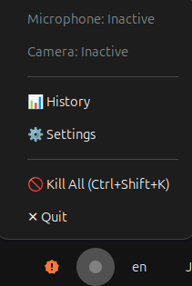
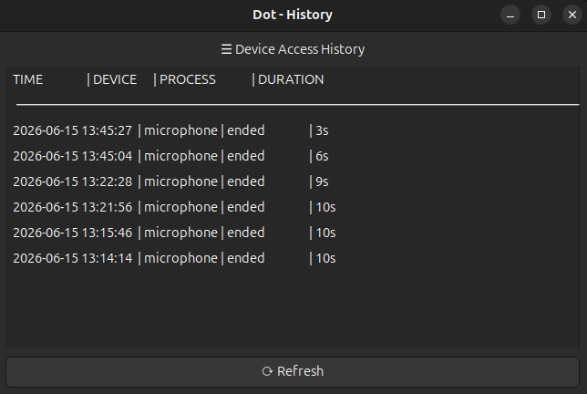
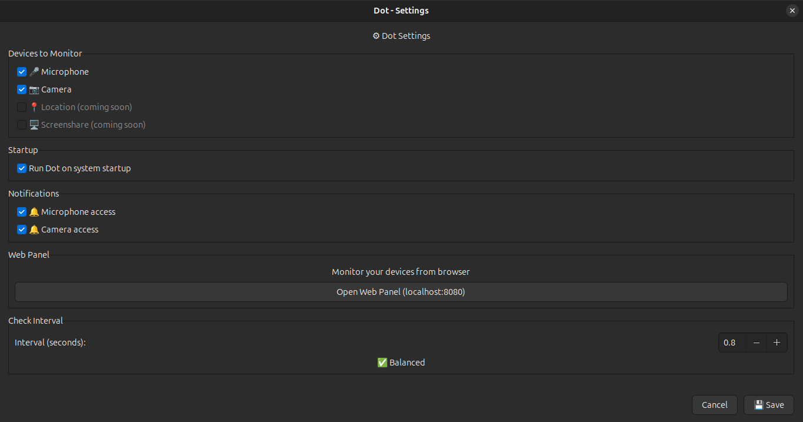
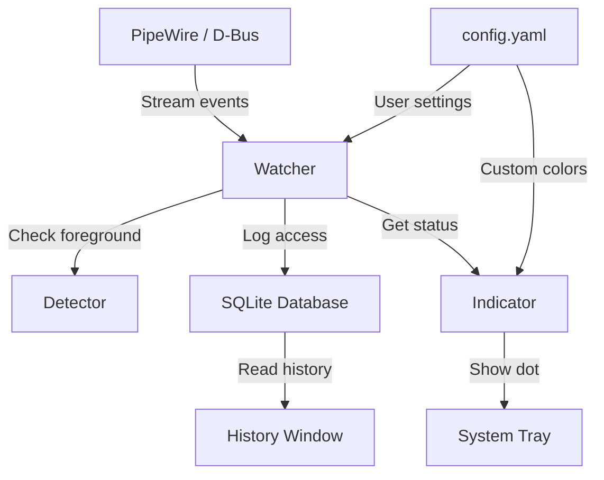

# 🟢 Dot - Privacy Indicator for Linux

> **Take back control of your privacy.**  
> A sleek system tray indicator that shows you exactly when apps are spying through your microphone or camera.

<p align="center">
  
</p>

---

## ✨ Features

| Feature | Description |
|---------|-------------|
| 🟢 **Green Dot** | A single app is using your device (in foreground) |
| 🟠 **Orange Dot** | Multiple apps are accessing your device simultaneously |
| ⚪ **Gray Dot** | All clear — no activity detected |
| 📊 **History Log** | SQLite database with timestamps, app names, and duration |
| ⚙️ **Settings GUI** | Enable/disable monitoring per device, customize colors |
| 🚀 **Auto-start** | Runs silently on boot, stays in system tray |
| 🐧 **Native Linux** | Built with GTK3 and AppIndicator, integrates with GNOME/Ubuntu |

---

## 🎯 Why Dot?

Android 12 introduced the famous green dot indicator. iOS has it. Windows has it.  
**Linux desktop didn't — until now.**

Dot monitors **PipeWire/PulseAudio streams** and **video devices** in real-time.
If any app accesses your microphone or camera, you'll know immediately.

---

## 📸 Screenshots

| System Tray | Menu | History | Settings |
|-------------|------|---------|----------|
|  |  |  |  |

---

## 🛠️ Tech Stack

- **Python 3** — Core logic
- **GTK3 + AppIndicator3** — Native Linux UI
- **SQLite3** — Lightweight local logging
- **PipeWire / D-Bus** — Audio/video stream monitoring
- **psutil** — Process information
- **YAML** — User configuration

---

## 📦 Installation

### Prerequisites

```bash
sudo apt update
sudo apt install gir1.2-appindicator3-0.1 python3-pip python3-gi-cairo xdotool -y
pip install psutil pyyaml pygobject --break-system-packages
```

### Clone & Run

```bash
git clone https://github.com/YOUR_USERNAME/Dot.git
cd Dot
python3 main.py
```

### Autostart (run on boot)

Create this file:

**`~/.config/autostart/dot.desktop`**

```ini
[Desktop Entry]
Type=Application
Name=Dot
Comment=Privacy Indicator
Exec=python3 /home/YOUR_USERNAME/Dot/main.py
StartupNotify=false
Terminal=false
X-GNOME-Autostart-enabled=true
```

> ⚠️ Replace `YOUR_USERNAME` with your actual Linux username.

---

## 🎨 Configuration

Edit `config.yaml` to customize:

```yaml
devices:
  microphone: true
  camera: true
  location: false        # coming soon
  screenshare: false     # coming soon

colors:
  active: "#00FF00"      # Green - single app
  multiple: "#FFA500"    # Orange - multiple apps
  idle: "#808080"        # Gray - no activity

settings:
  check_interval: 0.1    # seconds
  auto_delete_logs: 30   # days
```

---

## 📊 How It Works



---

## 🚧 Roadmap

- [ ] 📍 **Location monitoring** (GPS / GeoClue)
- [ ] 🖥️ **Screenshare detection** (PipeWire video streams)
- [ ] 🔔 **Desktop notifications** on access
- [ ] 📈 **Statistics dashboard**
- [ ] 🎨 **Custom themes**
- [ ] 📦 **Debian package** for easy install
- [ ] 🐧 **Flatpak / Snap** distribution
- [ ] 🖥️ **KDE Plasma** support

---

## 🤝 Contributing

Pull requests are welcome!  
Found a bug? Open an [issue](https://github.com/YOUR_USERNAME/Dot/issues).

### Development

```bash
git clone https://github.com/YOUR_USERNAME/Dot.git
cd Dot
python3 -m venv .venv
source .venv/bin/activate
pip install -r requirements.txt
python3 main.py
```

---

## 📄 License

MIT © [OandONE] (2026)

---

## 🙏 Acknowledgments

- Inspired by Android 12 Privacy Indicators
- Built for the Linux community with ❤️
- Thanks to the PipeWire and GTK teams

---

<p align="center">
  <sub>If this project helped you, consider giving it a ⭐</sub>
</p>
